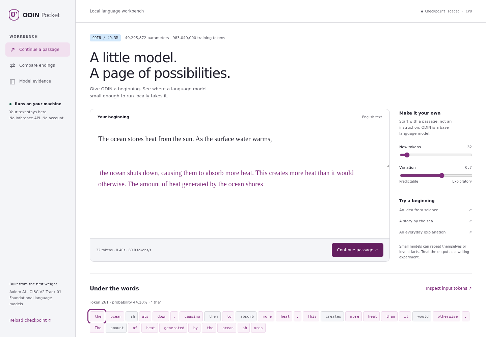

# ODIN Pocket

A **49,295,872-parameter causal language model**, trained from random initialization, with a local reading and writing workbench. Built for GIBC V2 Track 01.

**Axiom AI** · Yong Li Zhong · Solo developer.

**Status:** trained from scratch and fully evaluated. The local workbench and release checks pass. Source is public on GitHub. A YouTube/Vimeo/Youku video upload and Devpost submission remain separate, unverified steps.

## Use the workbench

Python 3.10 or later. In a fresh environment:

```bash
git clone https://github.com/Shoterz/odin-pocket.git
cd odin-pocket
python3 -m venv .venv
# RTX 4070 / CUDA 12.6 runtime:
.venv/bin/pip install torch==2.7.0 --index-url https://download.pytorch.org/whl/cu126
# CPU-only alternative: use https://download.pytorch.org/whl/cpu above.
.venv/bin/pip install -r requirements.txt
mkdir -p runs/pocket
curl --fail --location --output runs/pocket/submission.pt \
  https://github.com/Shoterz/odin-pocket/releases/download/v0.1.0/submission.pt
echo "4634f90b2120a7a128a0a4bbd59ae70056dbeff7baee2a35bf551fe0da90ab7e  runs/pocket/submission.pt" | sha256sum --check
bash run.sh --checkpoint runs/pocket/submission.pt --evidence submission/evidence
```

Open **http://127.0.0.1:8766**. In this development workspace, `run.sh` can use the already-installed `../project/.venv` as a fallback. This is an environment reuse, not a model-weight reuse; judges should use the fresh setup above.

The three views let you:

- **Continue a passage:** generate actual model tokens locally, with measured speed and token probabilities.
- **Compare endings:** rank possible continuations by average token log likelihood. This is a language preference, not a fact check or calibrated confidence.
- **Model evidence:** inspect the exact loaded checkpoint, recorded training loss, parameter count and matching benchmark reports. Unmeasured results stay unmeasured.

The model is a base next-token predictor, not an instruction-tuned chatbot. It can repeat text or generate incorrect facts. Input text remains local. The server binds to loopback and is intended for a single local user.



## Final weights and evidence

The inference-only checkpoint is `runs/pocket/submission.pt` (198,352,841 bytes). Download it from the [v0.1.0 release](https://github.com/Shoterz/odin-pocket/releases/tag/v0.1.0). It is distributed separately from the source archive.

SHA-256: `4634f90b2120a7a128a0a4bbd59ae70056dbeff7baee2a35bf551fe0da90ab7e`.

[English demo, 2m46s](submission/video/odin-pocket-demo.mp4) · [Submission handoff](submission/submit.md) · [Model card](submission/evidence/model-card.md) · [Training record](submission/evidence/training-summary.json) · [Data manifest](submission/evidence/data-manifest.json). No original training directory is needed to run the exported weights and evidence.

## Architecture

12 decoder blocks; width 512; 8 attention heads; rotary positions; RMS normalization; SwiGLU intermediate width 1536; context 512; byte-level BPE vocabulary 16,384. Input embedding and output weights are tied and counted once. No pretrained embeddings, checkpoint initialization, teacher outputs or hosted inference are used.

```bash
.venv/bin/python -c 'from odin.model import LanguageModel, ModelConfig; print(LanguageModel(ModelConfig()).parameter_count)'
# 49295872
```

Configuration: [configs/pocket.json](configs/pocket.json). Implementation: [odin/model.py](odin/model.py). The parameter limit is enforced before model allocation.

## Prepare data

Sources: [FineWeb-Edu](https://huggingface.co/datasets/HuggingFaceFW/fineweb-edu) (`ODC-By-1.0`) and the **training split only** of [WikiText-103](https://huggingface.co/datasets/Salesforce/wikitext) (`CC-BY-SA-3.0` / GFDL). Full source, revision, file hashes and filtering counts are written to `data/prepared/manifest.json`.

First cache the official benchmark datasets for overlap exclusion (this does not train on them):

```bash
.venv/bin/python scripts/cache_datasets.py --cache-dir .cache/datasets
mkdir -p data/raw
curl --fail --location --output data/raw/fineweb-edu-000.parquet \
  https://huggingface.co/datasets/HuggingFaceFW/fineweb-edu/resolve/87f09149ef4734204d70ed1d046ddc9ca3f2b8f9/sample/10BT/000_00000.parquet
.venv/bin/python -m odin.data \
  --fineweb data/raw/fineweb-edu-000.parquet --fineweb-documents 150000 \
  --benchmark-cache .cache/datasets --output data/prepared
```

Preparation normalizes and deduplicates complete documents, reserves a stable 1% development split by document hash, excludes matching benchmark 13-grams, trains BPE on training documents only, and packs document-delimited token streams. The overlap filter does **not** establish absence of short or paraphrased contamination. FineWeb-Edu uses model-assisted quality selection upstream; its training text is public web text, not privately generated teacher targets. See [data card](docs/data-card.md).

## Train from scratch

```bash
.venv/bin/python -m odin.train --data data/prepared --config configs/pocket.json \
  --output runs/pocket --steps 60000 --batch-size 16 --accumulation 2 \
  --device cuda --eval-every 250
```

This recipe processes 983,040,000 tokens. AdamW, peak learning rate 0.0006, 200 warmup steps, cosine decay to 10%, weight decay 0.1, global gradient clipping 1.0. CUDA uses bfloat16 autocast and float32 optimizer state. The completed run took **3.923 hours** on the local RTX 4070 12 GB, with **5,925,274,112 bytes** peak allocated CUDA memory. Approximate training compute is **2.908e+17 FLOPs**; preprocessing, the pilot, final checkpoint writing and the 108.7-second official evaluation are additional work.

To resume, repeat the same command with `--resume runs/pocket/latest.pt`. The trainer rejects different data/config/recipe and restores optimizer and RNG state. `--stop-after N` makes a planned interruption without changing the learning-rate schedule. Checkpoints include the tokenizer itself. `metrics.jsonl` records fixed-sample development loss; `summary.json` records hardware, precision, training time and token counters. Checkpoints are replaced atomically. On interruption, restart from the latest completed checkpoint.

## Official evaluation

Evaluate an immutable checkpoint copy. Use the required four tasks through `lm-evaluation-harness` with zero-shot prompts. Supply the WikiText-103 raw test Arrow file produced in the cache above:

```bash
.venv/bin/python -m odin.release export runs/pocket/latest.pt runs/pocket/submission.pt
.venv/bin/python -m odin.evaluate --checkpoint runs/pocket/submission.pt \
  --output results/official.json --device cuda --batch-size 8 \
  --dataset-cache .cache/datasets \
  --wiki-test .cache/datasets/Salesforce___wikitext/wikitext-103-raw-v1/0.0.0/b08601e04326c79dfdd32d625aee71d232d685c3/wikitext-test.arrow
```

`--limit 8` is a smoke test only; output is marked `partial`. Full evaluation omits `--limit`. Reports record checkpoint SHA-256, harness version, task versions and sample counts. WikiText scores complete articles with a document prefix and overlapping causal windows, counting each target once. Token perplexity is tokenizer-dependent; word perplexity and bits per byte are also recorded. The raw WikiText protocol is explicit and should not be conflated with other detokenized protocols.

| Benchmark | Accuracy | Length-normalized accuracy | Examples |
|---|---:|---:|---:|
| HellaSwag | 27.21% | 27.80% | 10,042 |
| ARC-Easy | 41.20% | 36.24% | 2,376 |
| PIQA | 57.94% | 56.96% | 1,838 |
| WinoGrande | 50.04% | — | 1,267 |

WikiText-103 raw test: **19.463 token perplexity**, 39.107 word perplexity, 0.9908 bits/byte over all 297,911 targets. The protocol and complete text identity are in [the full report](results/official.json).

These are baseline results, not evidence of state-of-the-art performance or a guaranteed win. WinoGrande is approximately chance. Frozen qualitative examples scored 3/6 comparisons and show repetition and false factual claims; inspect [all final outputs](results/product.json). The model is suitable for studying local language modeling, not factual advice.

## Local inference performance

On a 13th Gen Intel(R) Core(TM) i5-13400F with four CPU threads, paired generation measured **90.4 tokens/s** with KV caching versus **30.1** without it (3.01×). All 12 paired outputs were identical. This is one host and a six-prompt workload, not a universal speed guarantee. [Raw conditions and outputs](results/efficiency.json).

## Verification

```bash
.venv/bin/python -m pytest -q
```

Tests cover causal attention, parameter cap, loss, tokenizer roundtrip, document separation, exact CPU resume, stale-log recovery, continuation likelihood, rolling token coverage, malformed input, missing checkpoints and real localhost HTTP behavior. The suite needs permission to bind a loopback socket. The no-CUDA fallback test skips when CUDA is available.

## Attribution and eligibility

AI-assisted implementation, tests, interface, documentation and review: **OpenAI Codex**. No AI-generated private training corpus or teacher labels were used. Standard libraries: Python, PyTorch, NumPy, Hugging Face Tokenizers/Datasets/Transformers, Apache Arrow, EleutherAI lm-evaluation-harness, Matplotlib; browser verification uses Playwright and Chromium. Hardware: NVIDIA GeForce RTX 4070 12 GB. All additional tools and measurements must be recorded in the submission package.

Official requirements: [GIBC V2 rules](https://gibc-v2.devpost.com/rules). A public repository, an English 2–5-minute hosted demo, at least three screenshots, a complete Built With list and the team's real Devpost member identities are required. Local artifacts alone do not constitute a submitted entry.
